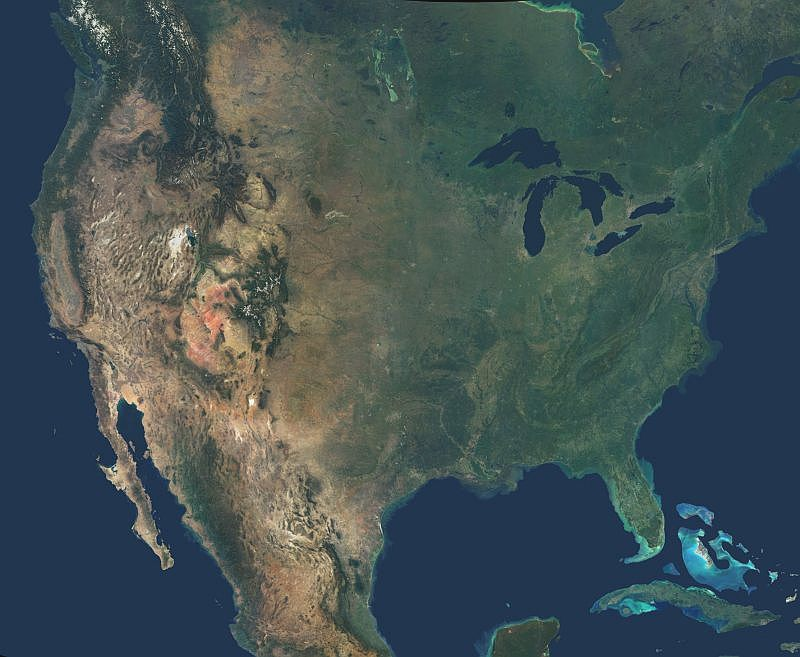

# Upside Down

A little app to flip some image tiles. Inspired by [this tweet](https://twitter.com/humeursdevictor/status/1181919227294433282) from [@humeursdevictor](https://twitter.com/humeursdevictor).

|||
|--|--|

## Clone the repository

`git clone https://gitlab.com/ben8t/upside_down.git && cd upside_down`

## Build Docker image

`docker build -t upside_down .`

## Run with the web app

`docker container run --rm -p 8501:8501 upside_down` and open your browser at `0.0.0.0:8501`.

## Run in command line

`docker container run --rm -v $(pwd)/app upside_down python main.py <source_image> <destination_image> <tile_shape>`

> Example : `docker container run --rm -v $(pwd)/app upside_down python main.py sample/america.jpg sample/fliped_image.jpg 25`
